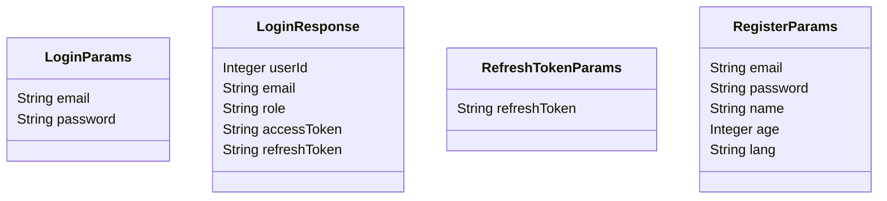
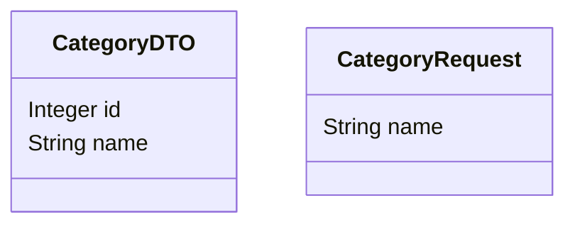
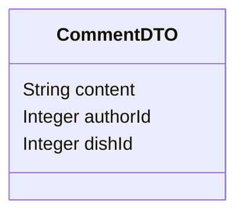
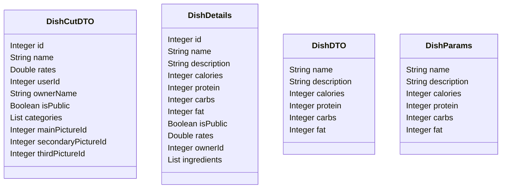
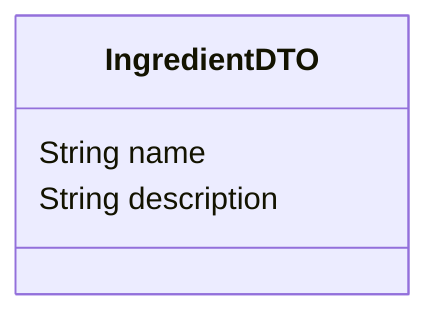

# SneakFit API Documentation v1.0.1

## 📋 Contents

- [Overview](#overview)
- [API Structure](#api-structure)
- [Base URL](#base-url)
- [Authentication](#authentication)
- [Content Negotiation](#content-negotiation)
- [Response Codes](#response-codes)
- [Endpoints](#endpoints)
- [Data Models](#data-models)
- [Environment Setup](#environment-setup)

## Overview
The **SneakFit API** is a RESTful service for recipe management, meal planning, and algorithmic food discovery.

### API Structure
The API is organized into the following resources:

```text
├── AI
│   ├── POST   /ai/ask
├── Auth                     # Authorization & Authentication
│   ├── POST   /auth/login
│   ├── POST   /auth/register
│   ├── POST   /auth/refresh
│   └── POST   /auth/revoke
├── Category                 # Recipe Categories
│   ├── POST   /category/add
│   └── DELETE /category/delete/{id}
├── Comment                  # Recipe Comments
│   ├── GET    /comment/{dishId}/all
│   ├── POST   /comment/{dishId}/add
│   ├── PUT    /comment/{commentId}/edit
│   └── DELETE /comment/{commentId}/delete
├── Dish                     # Recipes & Dishes
│   ├── GET    /dishes
│   ├── GET    /dish/{dishId}
│   ├── GET    /dish/recommended
│   ├── POST   /dish/add
│   ├── POST   /dish/{id}/favorite
│   ├── PUT    /dish/{dishId}/public
│   ├── PUT    /dish/{dishId}/update
│   └── DELETE /dish/{id}/delete
├── Image
│   ├── POST   /image
│   ├── PUT    /image/{dishId}/assign
│   ├── GET    /image/{dishId}/main
│   └── GET    /image/{dishId}/all
└── User                     # User Profile & Settings
    ├── PUT    /user/{id}/lang
    └── PUT    /user/{id}/settings
```

## Base URL
All URLs referenced in the documentation have the following base: https://localhost:7059

(TODO: Change to prod link)

## Authentication
This API uses **Bearer Token** authentication. You must include your API key in the `Authorization` header for all requests.

**Header:**
`Authorization: Bearer <YOUR_API_TOKEN>`

## Content Negotiation
* **Request Format:** `application/json`
* **Response Format:** `application/json`
* **Date Format:** All dates are returned in UTC, ISO 8601 format (`YYYY-MM-DDTHH:MM:SSZ`).

---

## Response Codes
The API uses standard HTTP status codes to indicate the success or failure of an API request.

| Code | Status | Description |
| :--- | :--- | :--- |
| **200** | OK | The request was successful. |
| **400** | Bad Request | The request was invalid or cannot be served (e.g., missing parameters). |
| **401** | Unauthorized | Authentication failed or user does not have permissions. |
| **404** | Not Found | The requested resource could not be found. |
| **500** | Server Error | Something went wrong on the server side. |

### Error Response Format
```bash
{
  "StatusCode": <CODE>,
  "Message": "<MESSAGE>",
  "ErrorCode": <ERROR_CODE>
}
```

---

# Endpoints

## 1. Authorization

#### Login
Authenticates a user and returns access tokens.

**Definition:**
`POST /auth/login`

**Query Parameters:**
| Parameter | Type | Required | Description |
| :--- | :--- | :--- | :--- |
| `email` | string | Yes | User's email address |
| `password` | string | Yes | User's password |

**Example Request:**
```bash
curl -X 'POST' \
  'https://<DOMAIN>/auth/login' \
  -H 'accept: text/plain' \
  -H 'Content-Type: application/json' \
  -d '{
  "email": "<YOUR_EMAIL>",
  "password": "<YOUR_PASSWORD>"
}'
```

**Example Response (200):**
```bash
{
  "userId": <ID>,
  "email": "<USER_EMAIL>",
  "role": "<USER_ROLE>",
  "accessToken": "<BEARER_TOKEN>"
}
```

---

#### Register
Creates a new user account.

**Definition:**
`POST /auth/register`

**Query Parameters:**
| Parameter | Type | Required | Description |
| :--- | :--- | :--- | :--- |
| `email` | string | Yes | User email address |
| `password` | string | Yes | User password |
| `name` | string | Yes | User name |
| `age` | integer | No | User age |
| `lang` | string | No | User preferred language. Allowed values: EN, PL, DE, ES. |

**Example Request:**
```bash
curl -X 'POST' \
  'https://<DOMAIN>/auth/register' \
  -H 'accept: text/plain' \
  -H 'Content-Type: application/json' \
  -d '{
  "email": "<YOUR_EMAIL>",
  "password": "<YOUR_PASSWORD>",
  "name": "<USER_NAME>",
  "age": "<USER_AGE>",
  "lang": "<USER_DEFAULT_LANG>"
}'
```

**Example Response (200):**
```bash
{
  "userId": <ID>,
  "email": "<USER_EMAIL>",
  "role": "<USER_ROLE>",
  "accessToken": "<BEARER_TOKEN>"
}
```

---

#### Refresh
Refreshes bearer token.

**Definition:**
`POST /auth/refresh`

**Query Parameters:**
| Parameter | Type | Required | Description |
| :--- | :--- | :--- | :--- |
| `refreshToken` | string | Yes | Refresh token |

**Example Request:**
```bash
curl -X 'POST' \
  'https://<HOST>/auth/refresh' \
  -H 'accept: text/plain' \
  -H 'Authorization: Bearer <TOKEN>' \
  -H 'Content-Type: application/json' \
  -d '{
  "refreshToken": "<REFRESH_TOKEN>"
}'
```

**Example Response (200):**
```bash
{
  "userId": <ID>,
  "email": "<USER_EMAIL>",
  "role": "<USER_ROLE>",
  "accessToken": "<BEARER_TOKEN>",
  "refreshToken": "<REFRESH_TOKEN>"
}
```

---

#### Revoke
Revokes auth token.

**Definition:**
`POST /auth/revoke`

**Query Parameters:**
| Parameter | Type | Required | Description |
| :--- | :--- | :--- | :--- |
| `refreshToken` | string | Yes | Refresh token |

**Example Request:**
```bash
curl -X 'POST' \
  'https://<HOST>/auth/revoke' \
  -H 'accept: text/plain' \
  -H 'Authorization: Bearer <TOKEN>' \
  -H 'Content-Type: application/json' \
  -d '{
  "refreshToken": "<REFRESH_TOKEN>"
}'
```

**Example Response (200):**
```bash
{}
```

---

## 2. Category

#### Add
Add new dish category.

**Definition:**
`POST /category/add`

**Query Parameters:**
| Parameter | Type | Required | Description |
| :--- | :--- | :--- | :--- |
| `name` | string | Yes | Category name |

**Example Request:**
```bash
curl -X 'POST' \
  'https://<HOST>/category/add' \
  -H 'accept: text/plain' \
  -H 'Authorization: Bearer <TOKEN>' \
  -H 'Content-Type: application/json' \
  -d '{
  "name": "<NAME>"
}'
```

**Example Response (200):**
```bash
{}
```

---

#### Delete
Soft delete dish category.

**Definition:**
`DELETE /category/{id}/delete`

**Query Parameters:**
| Parameter | Type | Required | Description |
| :--- | :--- | :--- | :--- |
| `id` | integer | Yes | Category ID |

**Example Request:**
```bash
curl -X 'DELETE' \
  'https://<HOST>/category/<ID>/delete' \
  -H 'accept: text/plain' \
  -H 'Authorization: Bearer <TOKEN>'
```

**Example Response (200):**
```bash
{}
```

---

## 3. Comment

#### Add
Add new recipe comment.

**Definition:**
`POST /comment/{dishId}/add`

**Query Parameters:**
| Parameter | Type | Required | Description |
| :--- | :--- | :--- | :--- |
| `dishId` | integer | Yes | Dish ID |
| `comment` | string | Yes | Comment content |

**Example Request:**
```bash
curl -X 'POST' \
  'https://<HOST>/comment/<ID>/add' \
  -H 'accept: text/plain' \
  -H 'Authorization: Bearer <TOKEN>' \
  -H 'Content-Type: application/json' \
  -d '"<CONTENT>"'
```

**Example Response (200):**
```bash
{}
```

---

#### Edit
Edit recipe comment.

**Definition:**
`PUT /comment/{commentId}/edit`

**Query Parameters:**
| Parameter | Type | Required | Description |
| :--- | :--- | :--- | :--- |
| `commentId` | integer | Yes | Comment ID |
| `comment` | string | Yes | Comment content |

**Example Request:**
```bash
curl -X 'PUT' \
  'https://<HOST>/comment/<ID>/edit' \
  -H 'accept: text/plain' \
  -H 'Authorization: Bearer <TOKEN>' \
  -H 'Content-Type: application/json' \
  -d '"<EDITET_CONTENT>"'
```

**Example Response (200):**
```bash
{
  "content": "<EDITED_CONTENT>",
  "authorId": <USER_ID>,
  "dishId": <DISH_ID>
}
```

---

#### Delete
Soft delete recipe comment.

**Definition:**
`DELETE /comment/{commentId}/delete`

**Query Parameters:**
| Parameter | Type | Required | Description |
| :--- | :--- | :--- | :--- |
| `commentId` | integer | Yes | Comment ID |

**Example Request:**
```bash
curl -X 'DELETE' \
  'https://<HOST>/comment/<ID>/delete' \
  -H 'accept: text/plain' \
  -H 'Authorization: Bearer <TOKEN>'
```

**Example Response (200):**
```bash
{}
```

---

#### Get All
Get all dish comments

**Definition:**
`GET /comment/{dishId}/all`

**Query Parameters:**
| Parameter | Type | Required | Description |
| :--- | :--- | :--- | :--- |
| `dishId` | integer | Yes | Comment ID |

**Example Request:**
```bash
curl -X 'GET' \
  'https://<HOST>/comment/<DISH_ID>/all' \
  -H 'accept: text/plain' \
  -H 'Authorization: Bearer <TOKEN>'
```

**Example Response (200):**
```bash
[
  {
    "content": "<CONTENT>",
    "authorId": <ID>,
    "dishId": <ID>
  },
  {
    "content": "<CONTENT>",
    "authorId": <ID>,
    "dishId": <ID>
  },
  {
    "content": "<CONTENT>",
    "authorId": <ID>,
    "dishId": <ID>
  }
]
```

---

## 4. Dish

#### Add
Desc sample.

**Definition:**
`POST /dish/add`

**Query Parameters:**
| Parameter | Type | Required | Description |
| :--- | :--- | :--- | :--- |
| `name` | string | Yes | Recipe name |
| `description` | string | No | Recipe description |
| `calories` | integer | No | Recipe calories |
| `protein` | integer | No | Recipe proteins |
| `carbs` | integer | No | Recipe carbs |
| `fat` | integer | No | Recipe fat |

**Example Request:**
```bash
curl -X 'POST' \
  'https://<HOST>>/dish/add' \
  -H 'accept: text/plain' \
  -H 'Authorization: Bearer <TOKEN>' \
  -H 'Content-Type: application/json' \
  -d '{
  "name": "<NAME>",
  "description": "<DESCRIPTION>",
  "calories": <CALORIES_NUM>,
  "protein": <PROTEINS_NUM>,
  "carbs": <CARBS_NUM>,
  "fat": <FAT_NUM>
}'
```

**Example Response (200):**
```bash
{}
```

---

#### Get dish details
Get dish details by ID.

**Definition:**
`GET /dish/{dishId}`

**Query Parameters:**
| Parameter | Type | Required | Description |
| :--- | :--- | :--- | :--- |
| `dishId` | integer | Yes | Recipe ID |

**Example Request:**
```bash
curl -X 'GET' \
  'https://<HOST>/dish/<DISH_ID>' \
  -H 'accept: text/plain' \
  -H 'Authorization: Bearer <TOKEN>'
```

**Example Response (200):**
```bash
{
  "id": <DISH_ID>,
  "name": "<DISH_NAME>",
  "description": "<DISH_DESCRIPTION>",
  "calories": <CALORIES_NUM>,
  "protein": <PROTEINS_NUM>,
  "carbs": <CARBS_NUM>,
  "fat": <FAT_NUM>,
  "isPublic": <IS_PUBLIC>,
  "rates": <RATES_NUM>,,
  "ownerId": <OWNER_ID>,
  "ingredients": <INGREDIENTS_ARRAY>,
}
```

---

#### Make Public
Make recipe public.

**Definition:**
`PUT /dish/{dishId}/public`

**Query Parameters:**
| Parameter | Type | Required | Description |
| :--- | :--- | :--- | :--- |
| `dishId` | integer | Yes | Recipe ID |

**Example Request:**
```bash
curl -X 'PUT' \
  'https://<HOST>/dish/<DISH_ID>/public' \
  -H 'accept: text/plain' \
  -H 'Authorization: Bearer <TOKEN>'
```

**Example Response (200):**
```bash
{}
```

---

#### Update dish
Update dish details.

**Definition:**
`PUT /dish/{dishId}/update`

**Query Parameters:**
| Parameter | Type | Required | Description |
| :--- | :--- | :--- | :--- |
| `dishId` | integer | Yes | Recipe ID |
| `name` | string | Yes | Updated recipe name |
| `description` | string | No | Updated dish decription |
| `calories` | integer | No | Updated recipe calories |
| `protein` | integer | No | Updated recipe proteins |
| `carbs` | integer | No | Updated recipe carbs |
| `fat` | integer | No | Updated recipe fat |

**Example Request:**
```bash
curl -X 'PUT' \
  'https://<HOST>/dish/<ID>/update' \
  -H 'accept: text/plain' \
  -H 'Authorization: Bearer <TOKEN>' \
  -H 'Content-Type: application/json' \
  -d '{
  "name": "<NAME>",
  "description": "<DESCRIPTION>",
  "calories": <CALORIES_NUM>,
  "protein": <PROTEINS_NUM>,
  "carbs": <CARBS_NUM>,
  "fat": <FAT_NUM>
}'
```

**Example Response (200):**
```bash
{
  "name": "<NAME>",
  "description": "<DESCRIPTION>",
  "calories": <CALORIES_NUM>,
  "protein": <PROTEINS_NUM>,
  "carbs": <CARBS_NUM>,
  "fat": <FAT_NUM>
}
```

---

#### Get dishes
Get all public and your private dishes.

**Definition:**
`GET /dishes`

**Query Parameters:**
| Parameter | Type | Required | Description |
| :--- | :--- | :--- | :--- |

**Example Request:**
```bash
curl -X 'GET' \
  'https://<HOST>/dishes' \
  -H 'accept: text/plain' \
  -H 'Authorization: Bearer <TOKEN>'
```

**Example Response (200):**
```bash
[
  {
    "id": <DISH_ID>,
    "name": "<NAME>",,
    "rates": <RATES_NUM>,
    "userId": <USER_ID>,
    "ownerName": "<OWNER_NAME>",
    "isPublic": <IS_PUBLIC>,
    "categories": ["<CATEGORY1>", "<CATEGORY2>"],
    "mainPictureId": <PICTURE_ID>
  },
 {
   <DISH_OBJECT>
 },
 {
   <DISH_OBJECT>
 }
]
```

---

#### Favorite dish
Make dish favorite.

**Definition:**
`PUT /dish/{id}/favorite`

**Query Parameters:**
| Parameter | Type | Required | Description |
| :--- | :--- | :--- | :--- |
| `id` | integer | Yes | Recipe ID |

**Example Request:**
```bash
curl -X 'PUT' \
  'https://<HOST>/dish/<ID>/favourite' \
  -H 'accept: text/plain' \
  -H 'Authorization: Bearer <TOKEN>'
```

**Example Response (200):**
```bash
{}
```

---

#### Delete dish
Soft delete dish.

**Definition:**
`DELETE /dish/{id}/delete`

**Query Parameters:**
| Parameter | Type | Required | Description |
| :--- | :--- | :--- | :--- |
| `id` | integer | Yes | Recipe ID |

**Example Request:**
```bash
curl -X 'DELETE' \
  'https://<HOST>/dish/<ID>/delete' \
  -H 'accept: text/plain' \
  -H 'Authorization: Bearer <TOKEN>'
```

**Example Response (200):**
```bash
{}
```

---

#### Recommended dishes
Get recommended dishes.

**Definition:**
`GET /dish/recommended`

**Query Parameters:**
| Parameter | Type | Required | Description |
| :--- | :--- | :--- | :--- |
| `maxResults` | integer | No | Count of recommended dishes to return |

**Example Request:**
```bash
curl -X 'GET' \
  'https://<HOST>/dish/recommended?maxResults=<MAX_RESULTS>' \
  -H 'accept: text/plain' \
  -H 'Authorization: Bearer <TOKEN>'
```

**Example Response (200):**
```bash
[
  {
    "id": <ID>,
    "name": "<NAME>",
    "rates": <RATES_NUM>,,
    "userId": <USER_ID>,,
    "ownerName": "<OWNER_NAME>",
    "isPublic": <IS_PUBLIC>,,
    "categories": ["<CATEGORY1>", "<CATEGORY2>"]
  },
  {
    "id": <ID>,
    "name": "<NAME>",
    "rates": <RATES_NUM>,
    "userId": <USER_ID>,
    "ownerName": "<OWNER_NAME>",
    "isPublic": <IS_PUBLIC>,
    "categories": ["<CATEGORY1>"]
  }
]
```

---

## 5. User

#### Language
Set user preferred language.

**Definition:**
`PUT /user/{id}/lang`

**Query Parameters:**
| Parameter | Type | Required | Description |
| :--- | :--- | :--- | :--- |
| `id` | integer | Yes | User ID |
| `lang` | string | No | User preferred language |

**Example Request:**
```bash
curl -X 'PUT' \
  'https://<HOST>/user/<ID>/lang?lang=<LANG>' \
  -H 'accept: text/plain' \
  -H 'Authorization: Bearer <TOKEN>'
```

**Example Response (200):**
```bash
{}
```

---

#### Settings
Update user settings.

**Definition:**
`PUT /user/{id}/settings`

**Query Parameters:**
| Parameter | Type | Required | Description |
| :--- | :--- | :--- | :--- |
| `id` | integer | Yes | User ID |
| `name` | string | No | User name |
| `age` | integer | No | User age |

**Example Request:**
```bash
curl -X 'PUT' \
  'https://<HOST>/user/<ID>/settings' \
  -H 'accept: text/plain' \
  -H 'Authorization: Bearer <TOKEN>' \
  -H 'Content-Type: application/json' \
  -d '{
  "name": "<NEW_NAME>",
  "age": <NEW_AGE>
}'
```

**Example Response (200):**
```bash
{}
```

## 6. AI

#### Ask
Ask AI for a dish recipe

**Definition:**
`POST /ai/ask`

**Parameters:**
| Parameter | Type | Required | Description |
| :--- | :--- | :--- | :--- |
| `categories` | Category[] | Yes | Dish categories |
| `testes` | string | yes | Taste of dish |
| `requiredTools` | string | yes | Taste of dish |
| `lang` | string | No | User preferred language |

**Example Request:**
```bash
curl -X 'POST' \
  'https://<HOST>/ai/ask' \
  -H 'accept: text/plain' \
  -H 'Content-Type: application/json' \
  -d '{
  "categories": [
    {
      "name": "<CATEGORY_NAME>"
    }
  ],
  "tastes": [
    "<DISH_TASTE>"
  ],
  "requiredTools": [
    "<TOOL>"
  ],
  "lang": "<LANG>"
}'
```

**Example Response (200):**
```bash
{
  ## Glazed Sweet Potato Dessert Strings

  **Categories:** String, Dessert, Vegetarian
  **Required Tools:** Stove, Non-stick skillet, Peeler or Spiralizer

  ### Ingredients (1 portion):
  * 1 medium (approx. 150g) - Sweet potato, peeled and julienned into long strings
  * 1.5 tbsp - Unsalted butter
  * 2 tbsp - Maple syrup
  * 1/2 tsp - Ground cinnamon
  * 1/4 tsp - Vanilla extract
  * 1 pinch - Sea salt
  * 1 tbsp - Water
  * 1 tbsp - Toasted crushed pecans (optional garnish)

  ### Preparation Steps:
  1. Prepare the sweet potato by using a spiralizer or a julienne peeler to create long, thin "string" noodles.
  2. Place the skillet over medium heat on the stove and melt the butter until it begins to foam.
  3. Add the sweet potato strings to the skillet. Sauté for 3–4 minutes, tossing gently with tongs to ensure they soften slightly without breaking.
  4. Stir in the maple syrup, cinnamon, vanilla extract, and sea salt. 
  5. Add the tablespoon of water. This creates a small amount of steam to help cook the "strings" through while the sugar emulsifies with the butter.
  6. Reduce the heat to medium-low and continue to cook for another 4–5 minutes, tossing frequently, until the liquid has reduced into a thick, glossy glaze that coats the strings.
  7. Once the strings are tender but still hold their shape (al dente), remove from heat.
  8. Plate the strings in a twirled nest and garnish with toasted pecans if desired.

  ### Estimates (per portion):
  * **Time:** 15 Minutes
  * **Calories:** 285 kcal
  * **Carbs:** 38 g
  * **Proteins:** 2 g
  * **Fat:** 14 g
}
```

---

## 7. Images

#### Add
Add image to db

**Definition:**
`POST /image`

**Parameters:**
| Parameter | Type | Required | Description |
| :--- | :--- | :--- | :--- |
| `file` | string | Yes | Dish image |

**Example Request:**
```bash
curl -X 'POST' \
  'https://<HOST>/image' \
  -H 'accept: text/plain' \
  -H 'Content-Type: multipart/form-data' \
  -F 'file=@<PHOTO_NAME.jpg;type=image/jpeg'
```

**Example Response (200):**
```bash
{
 {
  "url": "<IMG_URL>"
}
}
```

---

#### Assign
Assign image to dish

**Definition:**
`POST /image`

**Parameters:**
| Parameter | Type | Required | Description |
| :--- | :--- | :--- | :--- |
| `dishId` | integer | Yes | DishId |
| `mainId` | integer | No | ImageId |
| `secondId` | integer | No | ImageId |
| `thirdId` | integer | No | ImageId |

**Example Request:**
```bash
curl -X 'PUT' \
  'https://<HOST>/image/<ID>/assign?mainId=<IMAGEID>&secondId=<IMAGEID>&thirdId=<IMAGEID>' \
  -H 'accept: text/plain' \
  -H 'Authorization: Bearer <TOKEN>'
```

**Example Response (200):**
```bash
{}
```

---

#### Get Main Image
Get main image

**Definition:**
`GET /image/{dishId}/main`

**Parameters:**
| Parameter | Type | Required | Description |
| :--- | :--- | :--- | :--- |
| `dishId` | integer | Yes | DishId |

**Example Request:**
```bash
curl -X 'GET' \
  'https://<HOST>/image/<DISHID>/main' \
  -H 'accept: text/plain' \
  -H 'Authorization: Bearer <TOKEN>'
```

**Example Response (200):**
```bash
{
  "imageId": <ID>,
  "ownerId": <ID>,
  "url": "<IMG_URL>",
  "position": "<POSITION>"
}
```

---

#### Get All Dish Images
Get all dish images

**Definition:**
`GET /image/{dishId}/all`

**Parameters:**
| Parameter | Type | Required | Description |
| :--- | :--- | :--- | :--- |
| `dishId` | integer | Yes | DishId |

**Example Request:**
```bash
curl -X 'GET' \
  'https://<HOST>/image/<DISHID>/all' \
  -H 'accept: text/plain' \
  -H 'Authorization: Bearer <TOKEN>'
```

**Example Response (200):**
```bash
[
  {
    "imageId": <ID>,
    "ownerId": <ID>,
    "url": "<IMG_URL>",
    "position": "<POSITION>"
  },
  {
    "imageId": <ID>,
    "ownerId": <ID>,
    "url": "<IMG_URL>",
    "position": "<POSITION>"
  },
  {
    "imageId": <ID>,
    "ownerId": <ID>,
    "url": "<IMG_URL>",
    "position": "<POSITION>"
  }
]
```

---

# Data Models

<details>
<summary>Auth</summary>


</details>

<details>
<summary>Category</summary>


</details>

<details>
<summary>Comment</summary>


</details>

<details>
<summary>Dish</summary>


</details>

<details>
<summary>Ingredient</summary>


</details>

---

# Environment setup

## Repository Setup

#### Clone the Repository
```bash
git clone https://github.com/GruboKrojone/SneakFit.git
cd SneakFit
```

#### Switch to Development Branch
```bash
git checkout dev
```

#### Restore dependencies
```bash
dotnet restore
```

#### Build the project
```bash
dotnet build
```

#### Run the application
```bash
dotnet run --project API
```

---

## ⚠️ Important Configuration

> **Warning**
> Before running the application, you must create your own local configuration file.

### Create `appsettings.Local.json`

1. Navigate to the `API` project folder
2. Create a new file named `appsettings.Local.json`
3. Add the following configuration:

```json
{
  "Logging": {
    "LogLevel": {
      "Default": "Information",
      "Microsoft.AspNetCore": "Warning"
    }
  },
  "AllowedHosts": "*",
  "ConnectionStrings": {
    "SneakFitDbContext": "<YOUR_LOCAL_DB_CONNECTION_STRING>",
  },
  "App": {
    "Azure": {
      "ConnectionString": "<YOUR_AZURE_STORAGE_CONNECTION_STRING>",
      "ContainerName": "<YOUR_AZURE_STORAGE_CONTAINER_NAME>"
    },
    "Authentication": {
      "JwtKey": "<YOUR_SECRET_KEY>",
      "JwtExpireHours": <YOUR_JWT_EXPIRATION_HOURS>,
      "RefreshTokenExpireDays": <YOUR_REFRESH_TOKEN_EXPIRATION_DAYS>,
      "JwtIssuer": "<YOUR_JWT_ISSUER>",
      "InitPassword": "<YOUR_INITIAL_PASSWORD>"
    },
    "CORS": {
      "AllowedOrigins": [ "<YOUR_ALLOWED_ORIGIN>" ]
    }
  }
}

```

---

## Docker Setup

1. **Start the Services**

```bash
docker pull mcr.microsoft.com/mssql/server:2019-latest
docker run -e 'ACCEPT_EULA=Y' -e 'MSSQL_SA_PASSWORD=<YOUR_PASSWORD>' -p 1433:1433 -d --name sqlserver mcr.microsoft.com/mssql/server:2019-latest
```

Run docker container (if exists)

```bash
docker start sqlserver
```

Check running containers

```bash
docker ps
```

2. **Stoping Services**

```bash
docker stop sqlserver
```

### Creating new db migration

- Ensure Entity Framework tools are installed 
```bash
dotnet tool install --global dotnet-ef
```

- Update Entity Framework tools
```bash
dotnet tool update --global dotnet-ef
```

- In project root catalog run migrations add command
```bash
dotnet ef migrations add [MIGRATION_NAME] -s API -p Domain  --context SneakFitDbContext
```

- Run database update command
```bash
dotnet ef database update -s API -p Domain  --context SneakFitDbContext
```