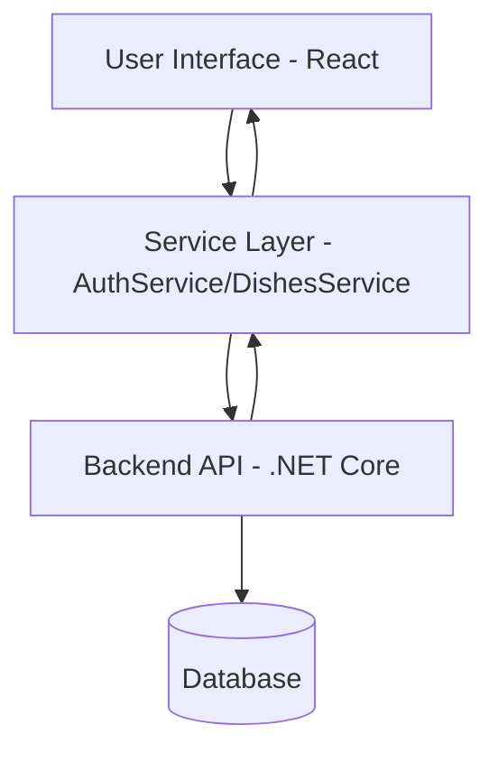

# Technical Documentation - SneakFit Project (Frontend)

## 1. General Information
*   **Project Name:** SneakFit
*   **Application Goal:** A comprehensive web platform for individuals conscious of their diet. The application allows users to browse recipes, calculate nutritional values (macronutrients), manage a list of favorite dishes, and interact with other users through a comment system.
*   **Functional Scope:**
    *   Login and registration system (JWT).
    *   Dynamic dish list with search functionality.
    *   Detailed dish view (ingredients, calories, macros).
    *   Dish creator (multi-step form with image upload).
    *   Profile management and language settings.
    *   Responsive interface with Dark Mode support.
*   **Authors:** SneakFit Team.

## 2. Requirements
### Functional
*   **Authentication:** Registration of new users, logging into existing accounts, logging out.
*   **Content Management:** Adding, editing, and deleting recipes.
*   **Interactions:** Adding comments under dishes and rating them.
*   **Personalization:** Interface language change (PL, EN, DE, ES), saving dishes in the "Favorites" section.

### User Stories
1.  **As a user**, I want to create an account so that I can save my favorite recipes.
2.  **As a user**, I want to see the total calories in a dish so that I can control my diet.
3.  **As a creator**, I want to add a photo to my recipe to encourage others to try it.
4.  **As a user**, I want to filter dishes by category to quickly find what I am looking for.

### Non-functional
*   **Security:** Storing JWT tokens in localStorage, HTTPS, data schema validation (Zod).
*   **Accessibility:** Use of semantic HTML standards and MUI components.
*   **Scalability:** Modular architecture (separation of services and components).

## 3. System Architecture
The application is designed as a **Single Page Application (SPA)** using React. Communication with the server occurs asynchronously through a service layer using the Fetch API.

### Data Flow Diagram (Mermaid)


## 4. Tech Stack
*   **Language and Framework:** React 19 + TypeScript.
*   **Build Tool:** Vite (provides fast hot-reload).
*   **Styling:** Vanilla CSS (dedicated style files for components and pages), Material UI (icons, advanced UI components).
*   **Form Management:** React Hook Form + Zod (client-side validation).
*   **Internationalization:** i18next + react-i18next.
*   **Navigation:** React Router DOM.
*   **Notifications:** React Toastify, SweetAlert2.

## 5. Project Structure
```text
src/
├── components/         # UI Components (NavBar, Modals, Inputs)
│   ├── styles/         # Local CSS styles for components
│   └── constants/      # Constants (e.g., keys, category options)
├── pages/              # Main views (Home, Login, DishDetails)
├── services/           # API Logic (AuthService, DishesService)
├── translations/       # i18n (JSON files with translations)
├── hooks/              # Custom React Hooks
├── utils/              # Helper functions
├── App.tsx             # Main routing tree
└── main.tsx            # Entry point (React initialization)
```

## 6. API / Backend
Base API URL: `https://localhost:7059`

### Key Endpoints:
| Method | Endpoint | Description |
| :--- | :--- | :--- |
| POST | `/auth/login` | User login, returns a JWT token. |
| POST | `/auth/register` | Creating a new user account. |
| GET | `/dishes` | Fetching a list of all available dishes. |
| POST | `/dish/add` | Creating a new dish (authorization required). |
| GET | `/dish/{id}` | Fetching details of a specific dish. |
| POST | `/dish/{id}/comment` | Adding a comment to a dish. |

## 7. Data Models (Interfaces)
Basic dish model in the system:
```typescript
interface Dish {
  id: number;
  name: string;
  description?: string;
  calories: number;
  protein: number;
  carbs: number;
  fat: number;
  ingredients: Ingredient[];
  categories: Category[];
  isPublic: boolean;
}
```

## 8. UI / UX
*   **Responsiveness:** The application works smoothly on mobile devices thanks to the RWD (Responsive Web Design) system implemented in native CSS code.
*   **Themes:** Dark/Light Mode support controlled by a dedicated `ThemeButton`.
*   **Interactivity:** Use of animations (e.g., when loading lists) and clear toast messages for errors or success.

## 9. Installation and Setup
### Requirements:
*   Node.js v18.x or later.
*   npm (included with Node.js).

### Steps:
1.  Download the source code from the repository.
2.  Install dependencies:
    ```bash
    npm install
    ```
3.  Start development mode:
    ```bash
    npm run dev
    ```
4.  Open the browser at: `http://localhost:5173`.

## 10. Security
*   **JWT (JSON Web Token):** Token-based authorization sent in the HTTP header.
*   **Data Sanitization:** Zod validation prevents sending incomplete or incorrectly formatted data to the API.
*   **SSL Certificate:** The backend runs on HTTPS, ensuring data transmission encryption.
